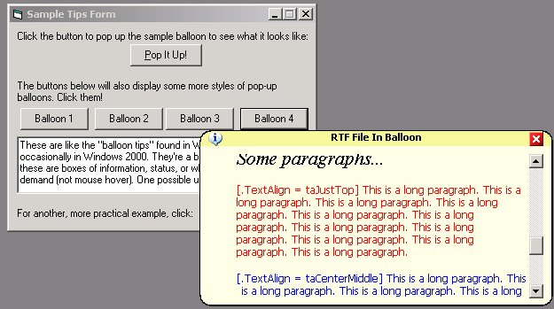



## Advanced Popup Balloon Win2K/XP Style

### Description

This project is an enhancement/rewrite of another submission (see below). This project displays advanced Win2K/XP style "balloons". This version includes a title bar that can be used to "drag" the ballon, RTF support, scrollable text, simple rounded rectangle code, API border drawing code, and completely dynamic resizable balloon. See the readme in the project for details from original author and notes about enhancements.

FYI: I had offerred to send this new code to the author for inclusion in the original but he wanted to keep his code separate so I figured I would go ahead and post my enhancements for everyone with his permission. (see the chat on the original post)

----

Clip from other submission 

----

This code will show Windows 2000/XP-style popup balloons. They were introduced in Windows 2000, and in XP they're seen all over, especially in the system tray. But Microsoft hasn't released how to use them yet (except for tray icons),and--if they did--it would only work on Windows 2000 or later. This project shows you how you can use these balloons in your programs. Instead of relying on Windows to make them, this program makes its own. Therefore, it will not only work with Windows 2000 and XP, but also with all other versions of Windows (down to 95).

.....

Original submission can be found here:

http://www.planet-source-code.com/vb/scripts/ShowCode.asp?txtCodeId=31434&lngWId=1
 
### More Info
 

             |
---                |---
**Submitted On**   |2002-02-05 21:48:46
**By**             |[Limbo](https://github.com/Planet-Source-Code/PSCIndex/blob/master/ByAuthor/limbo.md)
**Level**          |Intermediate
**User Rating**    |4.9 (123 globes from 25 users)
**Compatibility**  |VB 6\.0
**Category**       |[Custom Controls/ Forms/  Menus](https://github.com/Planet-Source-Code/PSCIndex/blob/master/ByCategory/custom-controls-forms-menus__1-4.md)
**World**          |[Visual Basic](https://github.com/Planet-Source-Code/PSCIndex/blob/master/ByWorld/visual-basic.md)
**Archive File**   |[Advanced\_P53335252002\.zip](https://github.com/Planet-Source-Code/limbo-advanced-popup-balloon-win2k-xp-style__1-31523/archive/master.zip)

